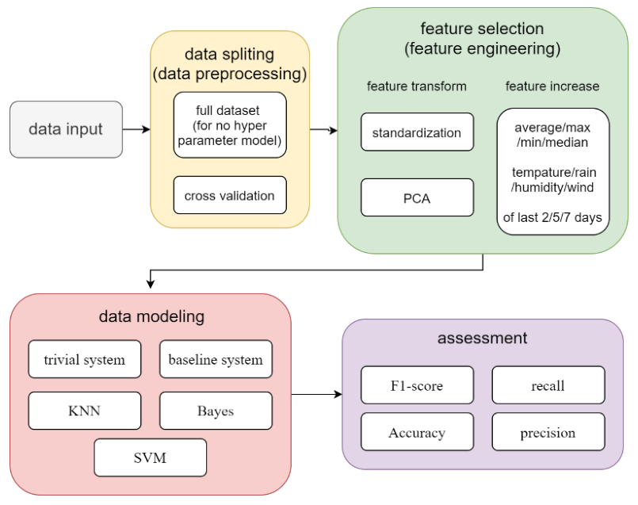
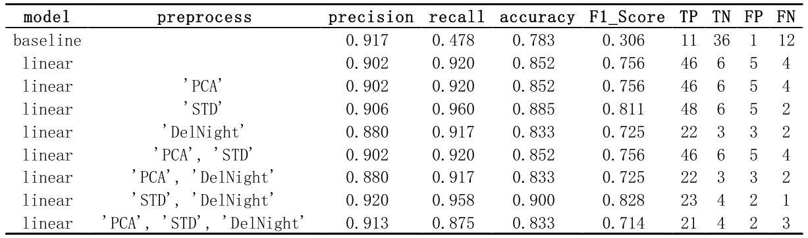
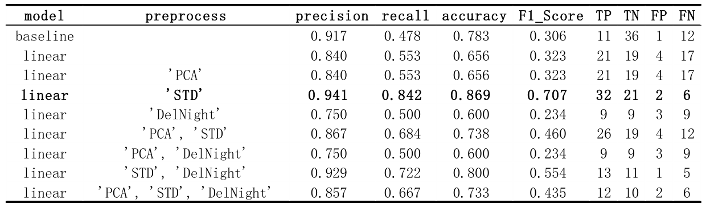
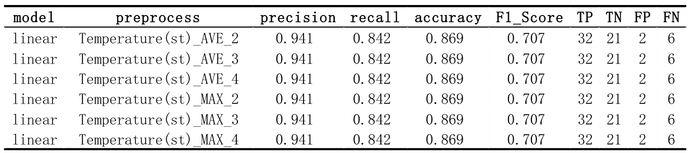
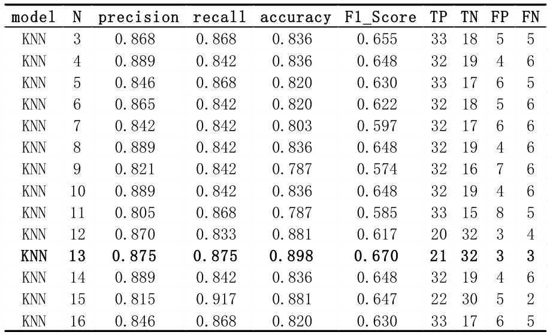
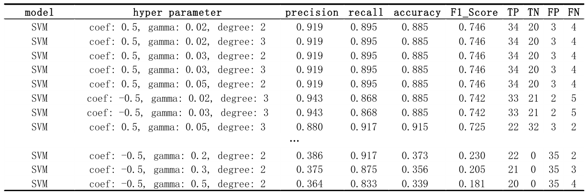
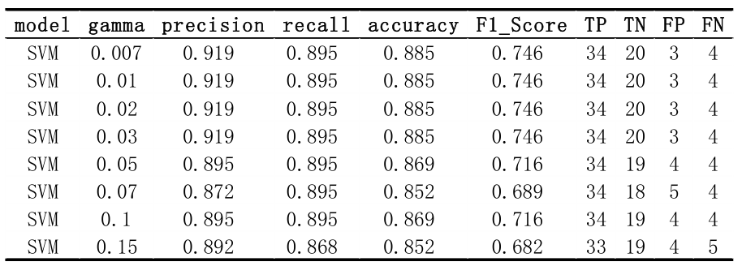
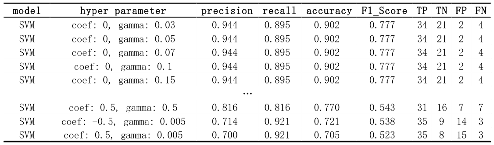
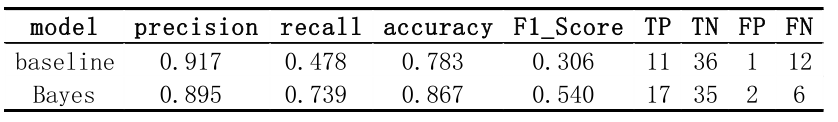
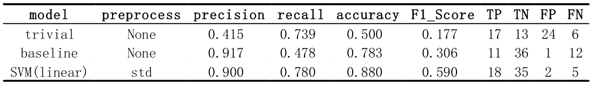

### Forest Fires Prediction

This is the final project of EE 559, USC. Click [here] to read the whole report. Here, I will only make a brief introduction and conclusion of this project.

##### Abstract

The fire happened frequently in Algeria in summer, so it is crucial to set up a model to predict the fire by using the sensor data. To find the best model, I will use the data over the period of 3 months as a training dataset, and 1 month as a test dataset. Use cross validation method to separate the training dataset.

Before training, I will show the data, and use Nearest Mean Classifier to compare 4 methods of data preprocessing, which include PCA, standardization, delete the night data, increase new features by the average/min/max of last N days. And find out that use standardization singly will get the best performance.

In the model selection and training part, I will try to use 4 models, which are Nearest Mean Classifier, KNN, SVM, and bayes. Compare the F1 score, accuracy, precision, recall, and confusion matrix for those models, and finally get the best performance by linear kernel SVM.

Python and its corresponding libraries Numpy, sklearn, pandas, json, and scipy will be used in this problem.

**Key words:** Classification, KNN, SVM, bayes, python.

##### Dataset Introduction

This data set has 10 features, which are listed as follows:
1）Temperature
2）RH: Humidity
3）Ws: wind speed
4）Rain: rain level
5）FFMC: Fine Fuel Moisture Code (indicator of the relative ease of ignition)
6）DMC: Duff Moisture Code (same as 6)
7）DC: Drought Code (same as 6)
8）ISI: Initial Spread Index (the ability of a fire to spread)
9）BUI: Buildup Index (amount of fuel available for combustion)

I will use four methods of data prepressing, which are standardization, PCA, adding new features, and separate the data by day and night. In PCA, I will keep the dimensions that can add up to more than 90% of contribution rate. And in adding new features method, I will create new features based on the original feature, such as Temperature or Humidity. Use the average/minimal/maximal of the last N days separate the daytime and night. By using this method, I will try to drop the original features and replace it by the new feature, or keep the original features. When using the last N days information, I will drop the last N days in the training data set, because this information will be used in test data set.  

##### Technology roadmap

##### Complexity Analysis

Due to different data preprocessing strategy, the totally possible combination of training models would grow exponentially. Whether to standardization or not are two possible choices. Whether to use cross validation or not are two possible choices. Whether to drop the night data or not are two choices. Whether use PCA or not, and use what contribution rate, there will be A possible choices. Adding what type of features and how many types of features, there will be B possible choices, using MAX/MIN/AVE will be 3 choices, and used last N days, N is another variable. Therefore, regardless of hyperparameter in the learning process, there will be 2\*2\*A\*B\*3\*N possible choices, that’s tons of choices. To minimize the workload, I will assume that in each learning model, those variables are all convex. That is, if I use SVM model, and the accuracy of using cross validation is better than not, then I will assume that whatever strategy I use, I will keep cross validation when splitting the data 

### Model Selection 

##### 1.  Nearest Mean Classification 

Note that in baseline system, TP and TN are completely upside down compare to other result. According to cross check, it is not a fault, because baseline system used the test set, while all the other result used the validation set.  

But there is another tricky question. Because there are lots of fire in August, the data in August will be intolerable biased. And the F1_Score will be surpassing all the other data. Therefore, I will drop August data as validation set from now on.  

The result show that only doing standardization as preprocessing method can get the best performance. And henceforth, all the data input will be standardized in all the models after. 

Adding one new feature of the data after standardization. There are 9 original features, each new feature I will try maximal/minimal/average 3 methods, and in each method, I will use the last 2/3/4 days. There will be 9*3*3=81 total possible combination. Part of the result below show that this modify are so slight that can hardly change anything. I think the reason of it is that because there are 9 features previously, so modifying one feature a bit will do nothing important to the result.  

##### 2. KNN (K-Nearest Neighbor)

From the result, n = 13 will have the best performance.  

##### 3. SVM (support vector machine)

There are 4 types of kernels: Linear, RBF, Polynomial and Sigmoid, and 3 hyper parameters, corresponding to different kernels: 

a) gamma: used in 'poly', 'RBF' and 'sigmoid', big gamma imply more support vector and over fitting; 

b) degree: only used in 'poly', typically less or equal than 3. 

c) coef0: used in 'poly' and 'sigmoid', lower coef0 will cause under fitting, and vice versa. 

**3.1 Polynomial Kernel** 

In polynomial kernel, to get the best performance, coefficient=0.5, gamma=0.03, and degree=3 

**3.2 RBF Kernel**

 **3.3 Sigmoid Kernel**

##### 4. Bayes

I assume each feature in the data satisfy Gaussian distribution with no correlation. Therefore, Gaussian distribution can be used to estimate the probability density of each feature. I will use Gaussian naïve Bayes to do this classification.  

### Conclusion

Among all the data preprocessing methods, all the models, and all the hyper parameter I used in the problem, the best choice is standardizing the data with no extra feature, and use soft margin linear kernel SVM to classify the data. And here is the result of trivial model, baseline model, and linear kernel SVM model running on the test set. 

Those three models do not have any hyperparameter, therefore it is meaningless to use cross validation to adjust the model.  

